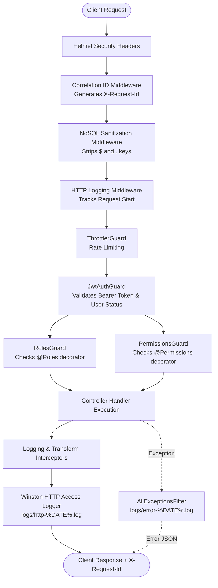

# Backend Architecture & Security Guide

Welcome to the backend architecture, security, and observability documentation for the Home Services Platform.

This guide provides an end-to-end overview of how authentication, Role-Based Access Control (RBAC), security middlewares, rotating file loggers, and guards are structured and how they work together to protect and monitor the application.

---

## Architecture Blueprint

The application employs a layered, zero-trust request processing pipeline. Every incoming HTTP request flows through security headers, NoSQL sanitizers, correlation tracking, rate limiting, authentication, and authorization guards before reaching controller handlers.

---

## Documentation Modules

| Document | Topic | Description |
| :--- | :--- | :--- |
| **[RBAC & Security Guide](./rbac-and-security.md)** | Roles, Permissions & Guards | Roles enum, permissions matrix, guards hierarchy, input sanitization, rate limiting, and ownership protection. |
| **[Logging & Observability Guide](./logging-and-observability.md)** | Logging & Error Handling | Winston daily rotating file logger, correlation IDs, exception filters, performance tracking, and log audits. |

---

## Core Principles

1. **Zero Trust & Server-Side Filtering**
   - As emphasized in [`db_docs.md`](../database/db_docs.md), IDs supplied in request payloads or query strings are never trusted blindly.
   - Access to resources (carts, bookings, unavailability, regions) is strictly filtered by the authenticated user's credentials (`req.user.userId`, `role`, and assigned regions).

2. **Defense in Depth**
   - **Network & Headers**: Protected by Helmet (HSTS, CSP, X-Content-Type-Options) and rate-limited via sliding windows.
   - **Database Protection**: NoSQL query injection attacks (e.g. `$gt`, `$ne`, `$where`) are stripped recursively before reaching controllers and Mongoose queries.
   - **Status Validation**: Inactive or blocked accounts (`UserStatus.BLOCKED`) are barred at the gateway level.

3. **Complete Observability & Auditability**
   - Every request is tagged with an `X-Request-Id` UUID across all logs and response headers.
   - Application logs, HTTP access logs, and error stack traces are segregated into separate, daily rotating, compressed files.
