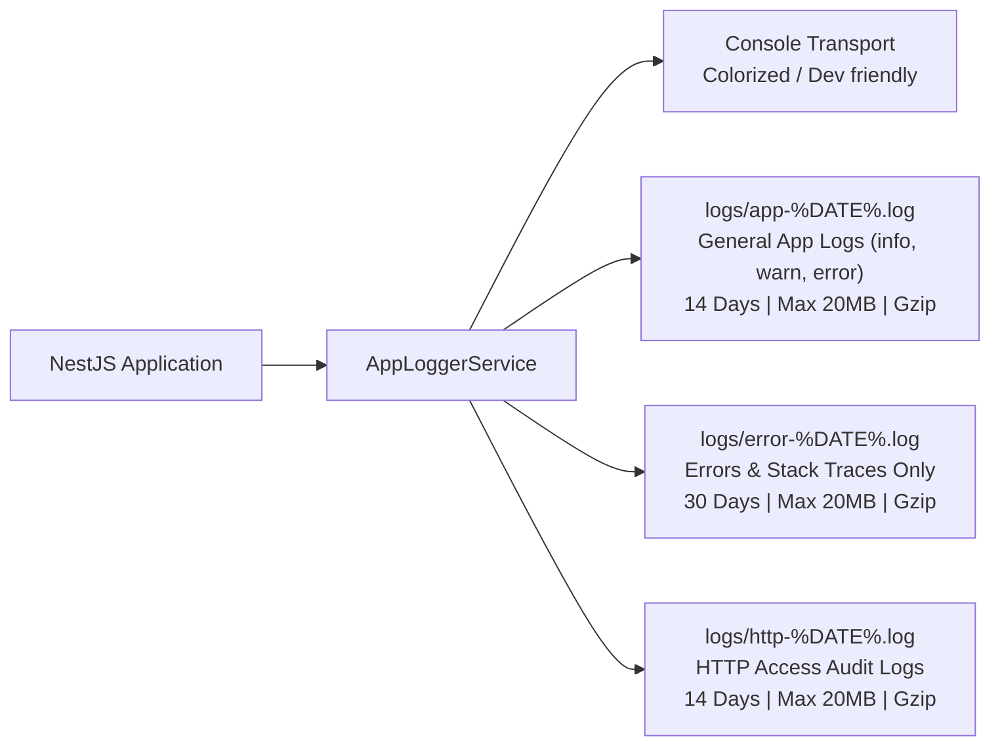
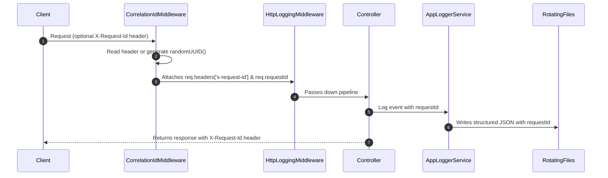

# Logging & Observability Guide

This document details the rotating file logging, request correlation, exception normalization, and performance tracking mechanisms implemented in the backend.

---

## 1. Rotating File Logging Architecture

The application uses **Winston** paired with **`winston-daily-rotate-file`** to provide an enterprise-grade, zero-maintenance log retention system. Logs are automatically rotated daily, split by severity and purpose, and compressed.



### Log Transports & Retention Policies

| Transport File | Log Levels Captured | Retention | Max File Size | Archive Strategy | Description |
| :--- | :--- | :--- | :--- | :--- | :--- |
| **`logs/app-%DATE%.log`** | `info`, `warn`, `error` | 14 days | 20 MB | Gzip compressed (`.gz`) | General business logic, startup events, database connections, and state transitions. |
| **`logs/error-%DATE%.log`** | `error` | 30 days | 20 MB | Gzip compressed (`.gz`) | Unhandled exceptions, failed transactions, and database errors with full stack traces. |
| **`logs/http-%DATE%.log`** | `http` | 14 days | 20 MB | Gzip compressed (`.gz`) | Complete HTTP access log (Method, URL, Status, Latency, IP, User Agent, Correlation ID). |
| **Console Transport** | All (debug in dev, info in prod) | Ephemeral | — | Colorized formatted stream | Local development and standard output for container runtimes. |

---

## 2. Request Correlation & Distributed Tracing

Every request is assigned a unique `X-Request-Id` UUID to link HTTP access logs, controller logs, and error stack traces.



### Log Record Schema

Log files record structured JSON lines with consistent metadata:

```json
{
  "timestamp": "2026-10-10 22:30:15.123",
  "level": "info",
  "context": "OrdersService",
  "requestId": "a5e8f420-1123-4d22-8d99-5231c51a942a",
  "message": "Checkout order created for customer 652a1...",
  "orderId": "6708b7...",
  "totalAmount": 49900
}
```

---

## 3. Global Exception Normalization (`AllExceptionsFilter`)

- **File**: [`all-exceptions.filter.ts`](../src/common/filters/all-exceptions.filter.ts)
- Configured globally in `main.ts`.

### Automated Database Error Mapping

Instead of exposing raw database error strings to the client, the exception filter normalizes errors into clean HTTP responses while logging full technical traces to `logs/error-%DATE%.log`:

| Exception Cause | Raw Error | Sanitized HTTP Response | Status Code |
| :--- | :--- | :--- | :--- |
| **Duplicate Key** | MongoDB `E11000 duplicate key error` | `"A record with this email already exists."` | `409 Conflict` |
| **Invalid ObjectId** | Mongoose `CastError: Cast to ObjectId failed` | `"Invalid format for field 'provider': 12345"` | `400 Bad Request` |
| **Mongoose Validation** | Mongoose `ValidationError` | Comma-separated validation messages | `400 Bad Request` |
| **NestJS HttpException** | Any `HttpException` (e.g. `NotFoundException`) | Preserves original message and status | Target Status |
| **Unhandled Runtime Error**| `Error` / `TypeError` / Uncaught | `"Internal server error"` | `500 Internal Server Error` |

### Standardized Error Contract

All API error responses adhere to the following JSON structure:

```json
{
  "statusCode": 409,
  "timestamp": "2026-10-10T17:00:00.000Z",
  "path": "/api/users",
  "method": "POST",
  "requestId": "7e34b1dc-5cf5-4e73-b789-29ea01991204",
  "error": "ConflictException",
  "message": "A record with this email already exists."
}
```

---

## 4. Performance Monitoring (`LoggingInterceptor`)

- **File**: [`logging.interceptor.ts`](../src/common/interceptors/logging.interceptor.ts)
- Measures handler execution time from entry to response return.
- If an endpoint execution exceeds **500ms**, it automatically emits a `SLOW QUERY DETECTED` warning tagged with `Performance` context and the elapsed duration:

```
22:30:15.123 WARN [Performance] SLOW QUERY DETECTED: POST /orders/checkout took 680ms
```

---

## 5. Developer Guide: Using the Logger

### Injecting `AppLoggerService` into Services

```typescript
import { Injectable } from '@nestjs/common';
import { AppLoggerService } from '../common';

@Injectable()
export class BookingsService {
  constructor(private readonly logger: AppLoggerService) {
    this.logger.setContext(BookingsService.name);
  }

  async confirmBooking(bookingId: string) {
    this.logger.log(`Confirming booking ${bookingId}`);
    try {
      // Business logic...
    } catch (error) {
      this.logger.error(`Failed to confirm booking ${bookingId}`, error.stack);
      throw error;
    }
  }
}
```

### Logging Custom HTTP / Audit Events

```typescript
this.logger.http('Payment webhook captured successfully', {
  event: 'payment.captured',
  paymentId: 'pay_xyz',
  amount: 49900,
});
```
