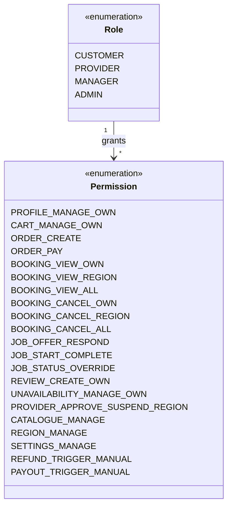
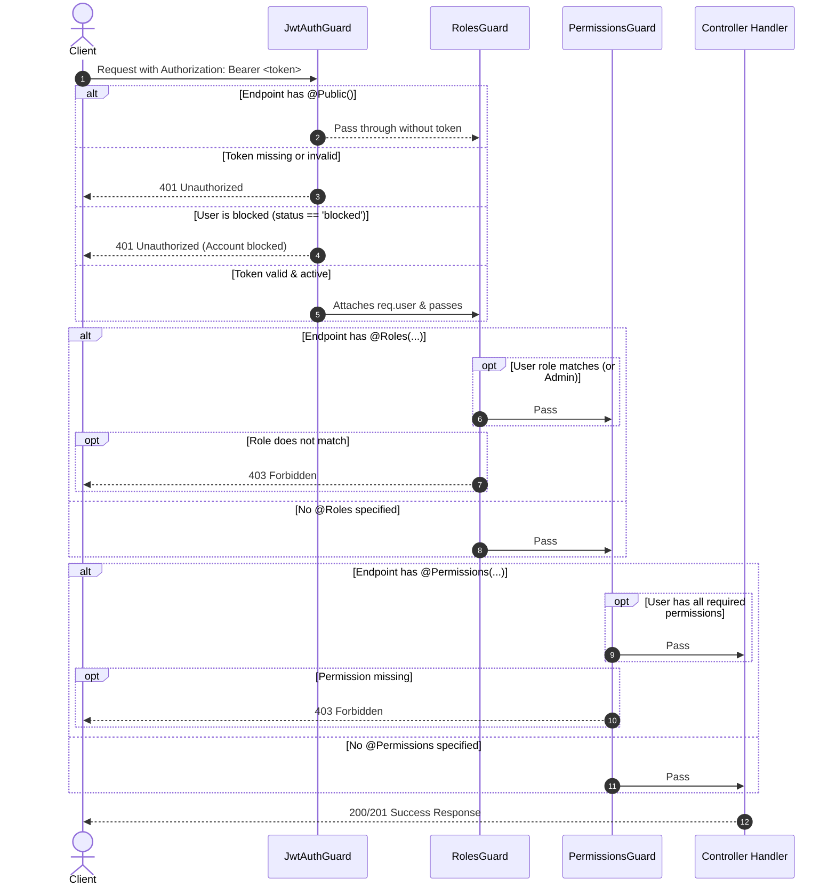

# Role-Based Access Control (RBAC) & Security Guide

This document explains the security architecture, role enums, permission matrix, guards, and security middlewares implemented in the backend.

---

## 1. Domain Enums

All enums are centralized in `src/common/enums/` and used across MongoDB schemas, DTOs, and controllers to guarantee type safety and schema consistency.

| Enum | Location | Allowed Values | Usage / Context |
| :--- | :--- | :--- | :--- |
| **`Role`** | [`roles.enum.ts`](../src/common/enums/roles.enum.ts) | `customer`, `provider`, `manager`, `admin` | Identifies the primary actor type for authentication and authorization. |
| **`UserStatus`** | [`user-status.enum.ts`](../src/common/enums/user-status.enum.ts) | `active`, `blocked` | Blocked accounts cannot authenticate or create bookings. |
| **`Gender`** | [`gender.enum.ts`](../src/common/enums/gender.enum.ts) | `male`, `female`, `other` | Demographics stored on User profile. |
| **`ProviderStatus`** | [`provider-status.enum.ts`](../src/common/enums/provider-status.enum.ts) | `pending`, `approved`, `suspended` | Only `approved` providers can receive job offers. |
| **`ManagerStatus`** | [`manager-status.enum.ts`](../src/common/enums/manager-status.enum.ts) | `active`, `suspended`, `inactive` | Regional managers can only operate when `active`. |
| **`PaymentStatus`** | [`order-status.enum.ts`](../src/common/enums/order-status.enum.ts) | `created`, `paid`, `failed`, `refunded`, `partially_refunded` | State of Order payment. |
| **`BookingStatus`** | [`booking-status.enum.ts`](../src/common/enums/booking-status.enum.ts) | `pending`, `awaiting_provider`, `confirmed`, `in_progress`, `completed`, `cancelled` | Full booking lifecycle. |
| **`CancelledBy`** | [`booking-status.enum.ts`](../src/common/enums/booking-status.enum.ts) | `customer`, `provider`, `manager`, `admin`, `system` | Tracks who initiated booking cancellation. |
| **`PayoutStatus`** | [`booking-status.enum.ts`](../src/common/enums/booking-status.enum.ts) | `pending`, `paid` | Settlement status for service providers. |
| **`RefundStatus`** | [`refund-status.enum.ts`](../src/common/enums/refund-status.enum.ts) | `initiated`, `processed`, `failed` | Gateway refund states within Payment document. |

---

## 2. Granular RBAC Permissions Matrix

Granular permissions are defined in [`permissions.enum.ts`](../src/common/enums/permissions.enum.ts). The platform enforces a permission matrix matching Section 6 of `db_docs.md`:



### Role-Permissions Grant Table

| Permission | Customer | Provider | Manager | Admin | Notes |
| :--- | :---: | :---: | :---: | :---: | :--- |
| `profile:manage:own` | ✅ | ✅ | ✅ | ✅ | Edit personal details and addresses |
| `cart:manage:own` | ✅ | — | — | ✅ | Modify cart items and selected address |
| `order:create` | ✅ | — | — | ✅ | Initialize checkout |
| `order:pay` | ✅ | — | — | ✅ | Complete Razorpay payment |
| `order:view:own` | ✅ | — | — | ✅ | View order history |
| `booking:view:own` | ✅ | ✅ | — | ✅ | Customer views own bookings; Provider views assigned bookings |
| `booking:view:region` | — | — | ✅ | ✅ | Manager monitors bookings in assigned regions |
| `booking:view:all` | — | — | — | ✅ | Platform-wide booking audit |
| `booking:cancel:own` | ✅ | ✅ | — | ✅ | Customer cancels pending/confirmed; Provider cancels confirmed (triggers reassignment) |
| `booking:cancel:region`| — | — | ✅ | ✅ | Manager cancels booking in assigned regions |
| `job:offer:respond` | — | ✅ | — | ✅ | Provider accepts or rejects job offer |
| `job:start_complete` | — | ✅ | — | ✅ | Provider marks `in_progress` and `completed` |
| `job:status:override` | — | — | ✅ | ✅ | Manager / Admin overrides status if dispute arises |
| `review:create:own` | ✅ | — | — | ✅ | Add review for completed booking |
| `unavailability:manage:own`| — | ✅ | — | ✅ | Provider adds/removes time-off blocks |
| `provider:approve_suspend:region` | — | — | ✅ | ✅ | Manager approves/suspends provider within regions |
| `catalogue:manage` | — | — | — | ✅ | Manage services and categories |
| `region:manage` | — | — | — | ✅ | Create and assign regions |
| `settings:manage` | — | — | — | ✅ | Edit commission fee, slot intervals, booking window |
| `refund:trigger:manual`| — | — | ✅ | ✅ | Trigger manual refund (manager limited to own regions) |
| `payout:trigger:manual`| — | — | — | ✅ | Trigger provider payout batch |

> **Note on Admin Privileges:** `Role.ADMIN` automatically inherits all permissions and bypasses role/permission constraints.

---

## 3. Guards Pipeline

Guards run before the route handler is invoked.



### Guard Specifications

1. **`JwtAuthGuard`** ([`src/common/guards/jwt-auth.guard.ts`](../src/common/guards/jwt-auth.guard.ts))
   - Checks for `@Public()` metadata. If present, allows unauthenticated access.
   - Extracts and verifies Bearer token via `AuthService`.
   - Inspects `user.status`: If `blocked`, immediately halts request with `401 Unauthorized`.
   - Attaches `AuthenticatedUser` payload to `request.user`.

2. **`RolesGuard`** ([`src/common/guards/roles.guard.ts`](../src/common/guards/roles.guard.ts))
   - Checks `@Roles(Role.PROVIDER, Role.ADMIN)` metadata.
   - Grants immediate access to `Role.ADMIN`.
   - Rejects unauthorized roles with `403 Forbidden`.

3. **`PermissionsGuard`** ([`src/common/guards/permissions.guard.ts`](../src/common/guards/permissions.guard.ts))
   - Checks `@Permissions(Permission.ORDER_CREATE)` metadata.
   - Evaluates whether the user's role grants every required permission.
   - Rejects with `403 Forbidden` if any required permission is missing.

4. **`UserStatusGuard`** ([`src/common/guards/user-status.guard.ts`](../src/common/guards/user-status.guard.ts))
   - Enforces that `user.status === UserStatus.ACTIVE` for state-mutating operations.

5. **`SelfOrAdminGuard`** ([`src/common/guards/self-or-admin.guard.ts`](../src/common/guards/self-or-admin.guard.ts))
   - Validates that non-admin callers can only operate on resources where `params.id` or `params.userId` equals `req.user.userId`.

---

## 4. Security Middlewares

### 4.1 NoSQL Injection Sanitization (`SanitizeInputMiddleware`)
- **File**: [`sanitize-input.middleware.ts`](../src/common/middlewares/sanitize-input.middleware.ts)
- **Problem**: MongoDB is susceptible to operator injection attacks such as:
  ```json
  { "email": { "$ne": null }, "password": { "$ne": null } }
  ```
- **Defense**: The middleware recursively walks `req.body`, `req.query`, and `req.params`, removing any object keys beginning with `$` or containing `.` before the payload reaches DTO validators or Mongoose queries.

### 4.2 Helmet Security Headers
- **Configured in**: [`main.ts`](../src/main.ts)
- **Protections**:
  - `Content-Security-Policy`: Restricts unauthorized script execution.
  - `Cross-Origin-Resource-Policy`: Prevents unauthorized cross-origin loading.
  - `X-Content-Type-Options: nosniff`: Mitigates MIME-type sniffing.
  - `Strict-Transport-Security` (HSTS): Enforces HTTPS connections.
  - `X-Frame-Options: SAMEORIGIN`: Prevents clickjacking attacks.

### 4.3 Rate Limiting (`@nestjs/throttler`)
- **Configured in**: [`app.module.ts`](../src/app.module.ts)
- **Policy**:
  - `THROTTLE_TTL`: Default 60,000ms (1 minute window).
  - `THROTTLE_LIMIT`: Default 100 requests per IP per window.
  - Configurable via `.env` variables (`THROTTLE_TTL`, `THROTTLE_LIMIT`).
  - `trust proxy` enabled in Express so client IPs behind reverse proxies (Nginx, Cloudflare) are accurately identified.

### 4.4 Correlation Tracking (`CorrelationIdMiddleware`)
- **File**: [`correlation-id.middleware.ts`](../src/common/middlewares/correlation-id.middleware.ts)
- Generates a UUID for every incoming request if `X-Request-Id` is not supplied.
- Attaches the ID to `req.headers['x-request-id']`, logs, and response headers (`res.setHeader('X-Request-Id', correlationId)`).

---

## 5. Developer Code Recipes

### Recipe A: Protecting a Controller with Roles
```typescript
import { Controller, Get, UseGuards } from '@nestjs/common';
import { JwtAuthGuard, RolesGuard, Roles, Role } from '../common';

@Controller('admin')
@UseGuards(JwtAuthGuard, RolesGuard)
@Roles(Role.ADMIN)
export class AdminController {
  @Get('dashboard')
  getAdminStats() {
    return { status: 'ok' };
  }
}
```

### Recipe B: Making an Endpoint Public
```typescript
import { Controller, Get } from '@nestjs/common';
import { Public } from '../common';

@Controller('categories')
export class CategoriesController {
  @Get()
  @Public() // Bypasses JwtAuthGuard
  findAll() {
    return this.categoriesService.findAll();
  }
}
```

### Recipe C: Protecting with Granular Permissions
```typescript
import { Controller, Post, Body, UseGuards } from '@nestjs/common';
import { JwtAuthGuard, PermissionsGuard, Permissions, Permission, CurrentUser, AuthenticatedUser } from '../common';

@Controller('orders')
@UseGuards(JwtAuthGuard, PermissionsGuard)
export class OrdersController {
  @Post()
  @Permissions(Permission.ORDER_CREATE)
  create(@Body() dto: CreateOrderDto, @CurrentUser() user: AuthenticatedUser) {
    // user.userId is guaranteed to be the authenticated customer
    return this.ordersService.create(user.userId, dto);
  }
}
```

### Recipe D: Extracting Current User ID
```typescript
import { Controller, Get } from '@nestjs/common';
import { CurrentUser } from '../common';

@Controller('profile')
export class ProfileController {
  @Get('me')
  getProfile(@CurrentUser('userId') userId: string) {
    return this.usersService.findById(userId);
  }
}
```
