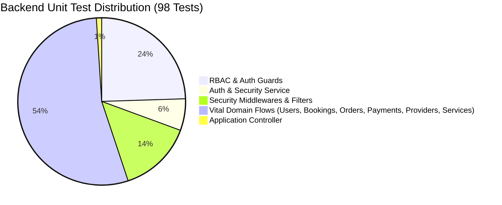

# Backend Testing & Verification Guide

This document details the unit test suite, test architecture, RBAC and authentication validation, vital domain flow tests, and test execution results for the backend.

---

## 1. Test Suite Summary

- **Total Test Suites**: 17 Passed / 17 Total (100%)
- **Total Unit Tests**: 98 Passed / 98 Total (100%)
- **Execution Time**: ~6.7s
- **Framework**: Jest with `ts-jest` on Node.js / NestJS



---

## 2. Test Architecture & Directory Structure

All unit tests are co-located alongside their source files using the `*.spec.ts` naming convention, ensuring that domain logic and test contracts evolve together:

```
back-end/
├── src/
│   ├── app.controller.spec.ts                     # Root controller health checks
│   ├── auth/
│   │   └── auth.service.spec.ts                   # Bcrypt hashing & JWT verification
│   ├── bookings/
│   │   └── bookings.service.spec.ts               # Booking lifecycle & slot overlap queries
│   ├── common/
│   │   ├── filters/
│   │   │   └── all-exceptions.filter.spec.ts      # Global exception transformer & Mongo error codes
│   │   ├── guards/
│   │   │   ├── jwt-auth.guard.spec.ts             # Bearer token & blocked user guard
│   │   │   ├── permissions.guard.spec.ts          # Granular RBAC permission checks
│   │   │   ├── roles.guard.spec.ts                # Role hierarchy & admin bypass
│   │   │   ├── self-or-admin.guard.spec.ts        # Resource ownership & ID tamper protection
│   │   │   └── user-status.guard.spec.ts          # Account state verification
│   │   ├── interceptors/
│   │   │   └── transform.interceptor.spec.ts      # Standardized API response envelope
│   │   └── middlewares/
│   │       ├── correlation-id.middleware.spec.ts  # X-Request-Id propagation
│   │       └── sanitize-input.middleware.spec.ts  # NoSQL injection sanitization ($ and .)
│   ├── orders/
│   │   └── orders.service.spec.ts                 # Order creation & customer history
│   ├── payments/
│   │   └── payments.service.spec.ts               # Gateway integration, webhooks & refunds
│   ├── providers/
│   │   └── providers.service.spec.ts              # Provider profiles & manager approval flow
│   ├── services/
│   │   └── services.service.spec.ts               # Catalogue browsing & category filtering
│   └── users/
│       └── users.service.spec.ts                  # User accounts & credential isolation
```

---

## 3. RBAC & Authentication Test Details

### 3.1 `AuthService` (`src/auth/auth.service.spec.ts`)
| Test Case | Scenario | Expected Behavior |
| :--- | :--- | :--- |
| `hashPassword` | Hashes plain text password | Returns secure salt-hashed string (`bcrypt.hash`); cannot match plaintext. |
| `comparePassword` (valid) | Compares plaintext with matching hash | Returns `true`. |
| `comparePassword` (invalid) | Compares plaintext with mismatched hash | Returns `false`. |
| `generateToken` | Passes `JwtPayload` to JWT service | Invokes `jwtService.signAsync` and produces signed token. |
| `verifyToken` (valid) | Verifies valid, unexpired token | Decodes and returns `JwtPayload` (`sub`, `email`, `role`, `status`). |
| `verifyToken` (invalid/expired) | Token invalid, malformed, or expired | Throws `UnauthorizedException` (`"Invalid or expired authentication token"`). |

### 3.2 `JwtAuthGuard` (`src/common/guards/jwt-auth.guard.spec.ts`)
| Test Case | Scenario | Expected Behavior |
| :--- | :--- | :--- |
| Public Route Bypass | Route has `@Public()` decorator | Passes immediately without requiring `Authorization` header. |
| Missing Header | No `Authorization` header provided | Throws `401 Unauthorized` (`"Authentication token is required"`). |
| Invalid Scheme | Scheme is `Basic` instead of `Bearer` | Throws `401 Unauthorized` (`"Authentication token is required"`). |
| Empty Token | Header is `Bearer ` with empty whitespace | Throws `401 Unauthorized` (`"Bearer token missing in authorization header"`). |
| Signature Tampering | `AuthService.verifyToken` fails | Throws `401 Unauthorized`. |
| Blocked Account | User payload has `status: 'blocked'` | Throws `401 Unauthorized` (`"Your account has been blocked. Contact support."`). |
| Active User Token | Valid token for active user | Attaches sanitized `req.user` (`userId`, `role`, `status`) and returns `true`. |

### 3.3 `RolesGuard` (`src/common/guards/roles.guard.spec.ts`)
| Test Case | Scenario | Expected Behavior |
| :--- | :--- | :--- |
| No Roles Required | Route lacks `@Roles(...)` metadata | Allows access to any authenticated caller. |
| Matching Role | User role matches allowed roles | Allows access (`true`). |
| Superuser Admin Bypass | User has `Role.ADMIN` | Unconditionally grants access regardless of required roles. |
| Role Mismatch | Customer attempts access to Manager route | Throws `403 Forbidden` (`"Access denied. Requires one of..."`). |

### 3.4 `PermissionsGuard` (`src/common/guards/permissions.guard.spec.ts`)
| Test Case | Scenario | Expected Behavior |
| :--- | :--- | :--- |
| No Permissions Required | Route lacks `@Permissions(...)` | Passes through (`true`). |
| Valid Permissions | Role grants required permissions (e.g. `ORDER_CREATE`, `ORDER_PAY`) | Allows execution. |
| Missing Permission | Customer attempts `CATALOGUE_MANAGE` | Throws `403 Forbidden` (`"Missing required permission(s)"`). |
| Superuser Admin Bypass | User has `Role.ADMIN` | Admin automatically inherits all permissions and bypasses checks. |

### 3.5 `SelfOrAdminGuard` (`src/common/guards/self-or-admin.guard.spec.ts`)
| Test Case | Scenario | Expected Behavior |
| :--- | :--- | :--- |
| Unauthenticated Access | `req.user` is undefined | Throws `403 Forbidden`. |
| Admin Bypass | Admin edits or views another user's ID | Allows execution (`true`). |
| Own Resource (`id`) | `params.id` matches `req.user.userId` | Allows access (`true`). |
| Own Resource (`userId`) | `params.userId` matches `req.user.userId` | Allows access (`true`). |
| Cross-Tenant Access | Customer tries to access another customer's ID | Throws `403 Forbidden` (`"Access denied. You can only access your own resource."`). |

### 3.6 `UserStatusGuard` (`src/common/guards/user-status.guard.spec.ts`)
| Test Case | Scenario | Expected Behavior |
| :--- | :--- | :--- |
| Unauthenticated Route | `req.user` is not set | Passes (`true`). |
| Active User | `user.status === UserStatus.ACTIVE` | Passes (`true`). |
| Inactive / Blocked User | `user.status === UserStatus.BLOCKED` | Throws `403 Forbidden` (`"Only active accounts may perform this action."`). |

---

## 4. Vital Domain Flow Tests

### 4.1 Users Flow (`src/users/users.service.spec.ts`)
- **Creation**: Stores user entity with hashed password, personal details, and active status.
- **Credential Protection**: `findAll()` and `findOne()` exclude the `password` field via `.select('-password')`.
- **Auth Lookup**: `findByEmail()` explicitly includes `.select('+password')` to enable login verification without leaking passwords to normal profile queries.
- **Updates & Deletion**: Modifies profiles, enforces `NotFoundException` on non-existent records.

### 4.2 Bookings Flow (`src/bookings/bookings.service.spec.ts`)
- **Booking Creation**: Instantiates new booking with scheduled date, time window, and initial `pending` status.
- **Provider & Customer Lookups**: Retrieves bookings filtered by `customer` or `provider`, populating linked services and orders.
- **Double-Booking Prevention**: `findActiveByProviderAndDate()` queries slot-holding bookings (`pending`, `awaiting_provider`, `confirmed`, `in_progress`) on the target date to ensure slots are not double-booked.
- **Lifecycle Updates**: Transition booking states (`confirmed`, `in_progress`, `completed`, `cancelled`), ensuring missing booking IDs throw `NotFoundException`.

### 4.3 Orders & Payments Flow (`src/orders/orders.service.spec.ts`, `src/payments/payments.service.spec.ts`)
- **Order Placement**: Calculates and stores items, convenience fees, and total amounts.
- **Customer Order History**: Retrieves orders chronologically by customer ID.
- **Razorpay Integration**: `findByRazorpayOrderId()` allows Razorpay webhook events to locate payment documents in `O(1)` time.
- **Refund Transitions**: Verifies updating payment records to `PaymentStatus.REFUNDED` with refund IDs and statuses.

### 4.4 Providers & Catalogue Flow (`src/providers/providers.service.spec.ts`, `src/services/services.service.spec.ts`)
- **Provider Onboarding**: Creates provider profile with location coordinates and `pending` verification state.
- **Regional Approval Flow**: Tests manager update transitioning provider status to `approved`.
- **Catalogue Filtering**: Tests `findAll()` fetching only active services, supporting optional `categoryId` query filters.

---

## 5. Security Middlewares, Filters & Interceptors

### 5.1 NoSQL Injection Sanitization (`src/common/middlewares/sanitize-input.middleware.spec.ts`)
- Recursively strips keys starting with `$` (e.g. `{ "$ne": null }`) or containing dots (`.`) across `req.body`, `req.query`, and `req.params`.
- Prevents MongoDB query tampering before data reaches Mongoose models.

### 5.2 Correlation Tracking (`src/common/middlewares/correlation-id.middleware.spec.ts`)
- Generates a UUID for incoming requests missing `x-request-id`.
- Reuses client-supplied `x-request-id` if present.
- Sets the `X-Request-Id` response header for client-side tracing.

### 5.3 Exception Standardization (`src/common/filters/all-exceptions.filter.spec.ts`)
- Formats standard `HttpException` instances into a consistent JSON envelope with timestamps, request methods, and correlation IDs.
- Maps MongoDB `11000 Duplicate Key` errors to `409 Conflict`.
- Maps Mongoose `CastError` (e.g. malformed ObjectId) to `400 Bad Request`.
- Maps Mongoose `ValidationError` to `400 Bad Request`.
- Catches unhandled runtime exceptions and returns `500 Internal Server Error` while logging the stack trace.

### 5.4 Response Envelope (`src/common/interceptors/transform.interceptor.spec.ts`)
- Normalizes all successful controller responses to `{ success: true, statusCode, data, timestamp }`.

---

## 6. How to Run the Tests

```bash
# Run all unit tests
pnpm test

# Run tests in watch mode during development
pnpm test:watch

# Run all unit tests with full code coverage report
pnpm test:cov

# Run a specific test suite (e.g. RBAC guards or Auth)
pnpm test guards
pnpm test auth
pnpm test bookings
```

---

## 7. Test Results Output Log

```
$ jest
PASS src/common/interceptors/transform.interceptor.spec.ts
PASS src/common/guards/user-status.guard.spec.ts
PASS src/common/filters/all-exceptions.filter.spec.ts
PASS src/common/middlewares/correlation-id.middleware.spec.ts
PASS src/common/middlewares/sanitize-input.middleware.spec.ts
PASS src/common/guards/self-or-admin.guard.spec.ts
PASS src/common/guards/roles.guard.spec.ts
PASS src/common/guards/permissions.guard.spec.ts
PASS src/common/guards/jwt-auth.guard.spec.ts
PASS src/app.controller.spec.ts
PASS src/auth/auth.service.spec.ts
PASS src/bookings/bookings.service.spec.ts
PASS src/payments/payments.service.spec.ts
PASS src/providers/providers.service.spec.ts
PASS src/services/services.service.spec.ts
PASS src/orders/orders.service.spec.ts
PASS src/users/users.service.spec.ts

Test Suites: 17 passed, 17 total
Tests:       98 passed, 98 total
Snapshots:   0 total
Time:        6.721 s
Ran all test suites.
```
